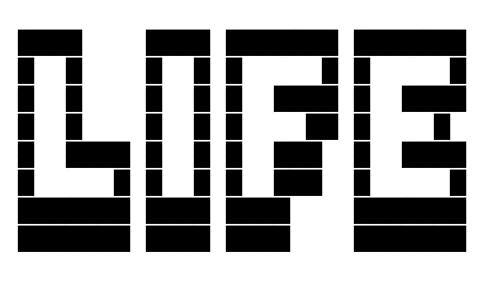
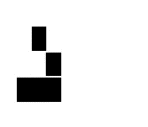
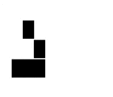
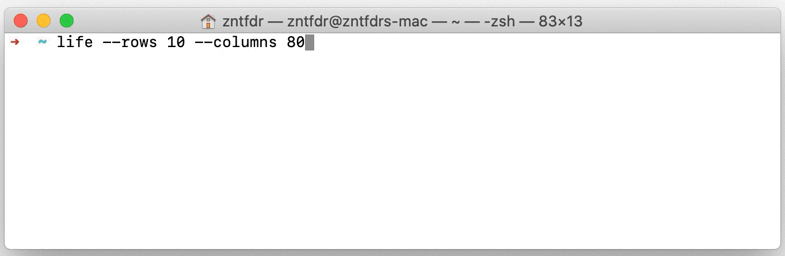

<p align="center">
    
</p>

<p align="center">
    
    <a href="https://swift.org/package-manager">
        
    </a>
     
    <a href="https://twitter.com/zntfdr">
        
    </a>
</p>

Welcome to **Life**, a Swift implementation of [Conway's Game of Life](https://en.wikipedia.org/wiki/Conway%27s_Game_of_Life).

## Usage

Life has two main entitites, `World` and `Cell`:

- `World` represents the game space, which is a two-dimensional orthogonal grid of square cells, it also keeps track of the current alive cells generation.

- `Cell` represents a specific cell in the world.

```swift
import Life

// Create a World instance.
var world = try World(rows: rows, columns: columns)

// Add alive cells.
world.add(Cell(row: .., column: ..))
world.add(Cell(row: .., column: ..))
...

// Spawn the next world generations.
world.spawnNextGeneration()
world.spawnNextGeneration()
...
```

A `World` instance only remembers the current alive generation, which is accessible via the `aliveCells` property.

At any moment new alive cells can be added, and _old_ alive cells can be removed, to do so use the `add(_:)` and `remove(_:)` `World` instance methods.

Lastly, `World` exposes an `isCellAlive(_:)` instance method to check whether the specified cell is part of the current generation.

> You can find many more examples in the [`Tests`](https://github.com/zntfdr/Life/tree/master/Tests/LifeTests) folder.

### Game modes

Life comes in two modes: Simple and Loop.  

The mode can be specified by passing an optional `mode` parameter when creating a new `World` instance (by default the mode is `.simple`) ]:

```swift
var world = try World(rows: rows, columns: columns, mode: .loop)
```

**Simple**|**Loop**
:-----:|:-----:|
Any cell outside of the world edges is considered dead. | The world left and right edges are stitched together, the world top and bottom edges are stitched together.|
 | |

## Installation

Life is distributed using the [Swift Package Manager](https://swift.org/package-manager). To install it into a project, follow [this tutorial](https://developer.apple.com/documentation/swift_packages/adding_package_dependencies_to_your_app) and use this repository URL: `https://github.com/zntfdr/Life.git`.

## Command line tool
<p align="center">
    

Life also comes with a command line tool that showcases its functionality.

To install it, clone the project and run make:

```shell
$ git clone https://github.com/zntfdr/Life.git
$ cd Life
$ make
```

## Credits

Life was built by [Federico Zanetello](https://twitter.com/zntfdr).

## Contributions and Support

All users are welcome and encouraged to become active participants in the project continued development — by fixing any bug that they encounter, or by improving the documentation wherever it’s found to be lacking.

If you'd like to make a change, please [open a Pull Request](https://github.com/zntfdr/Life/pull/new), even if it just contains a draft of the changes you’re planning, or a test that reproduces an issue.

Thank you and please enjoy using **Life**!